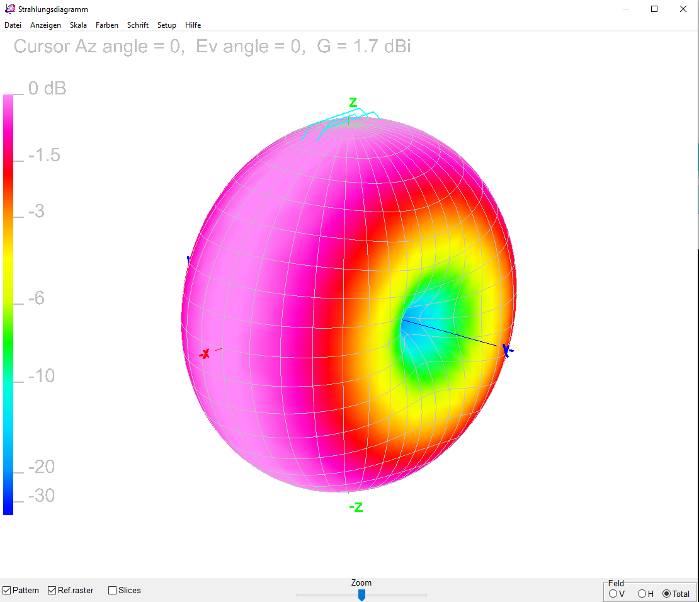
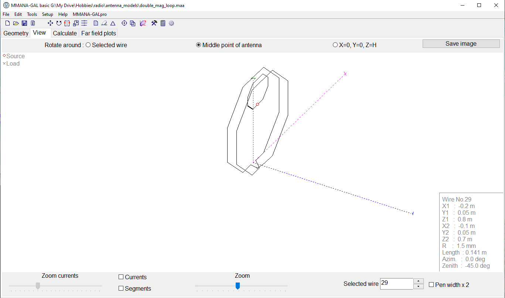
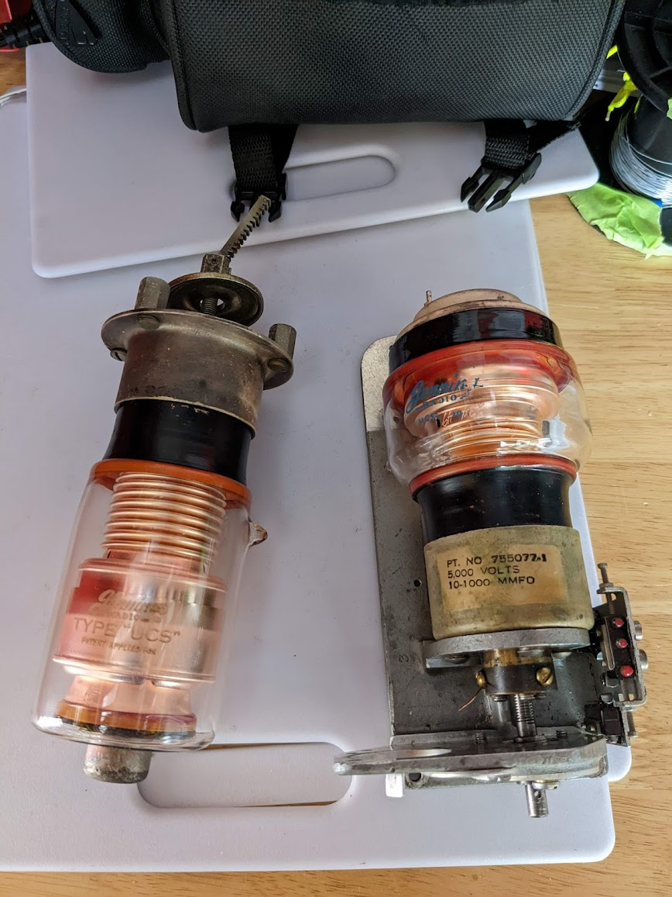
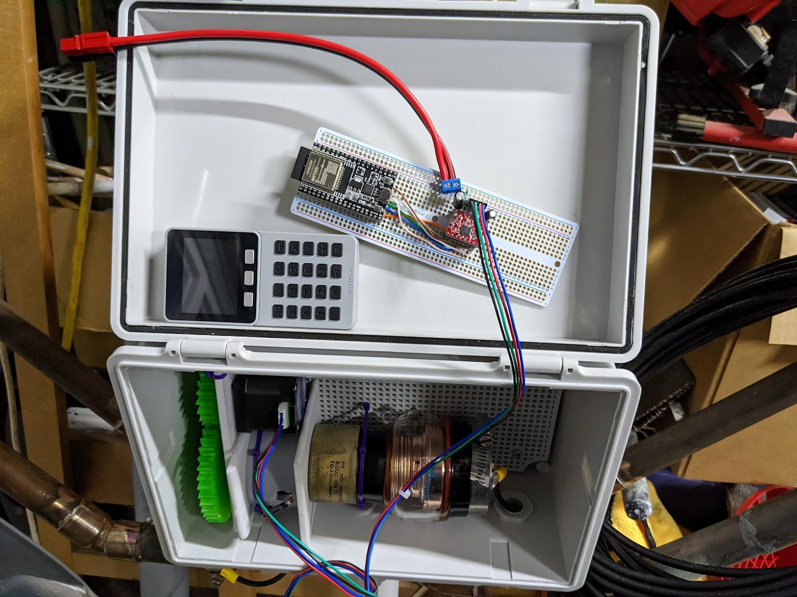
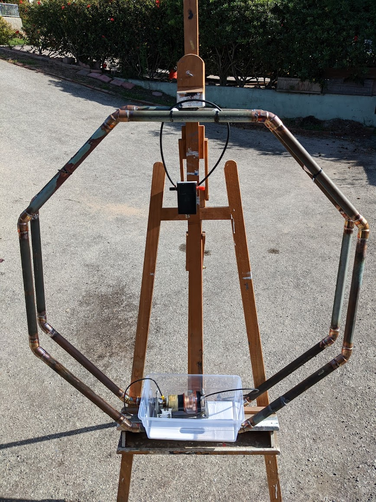
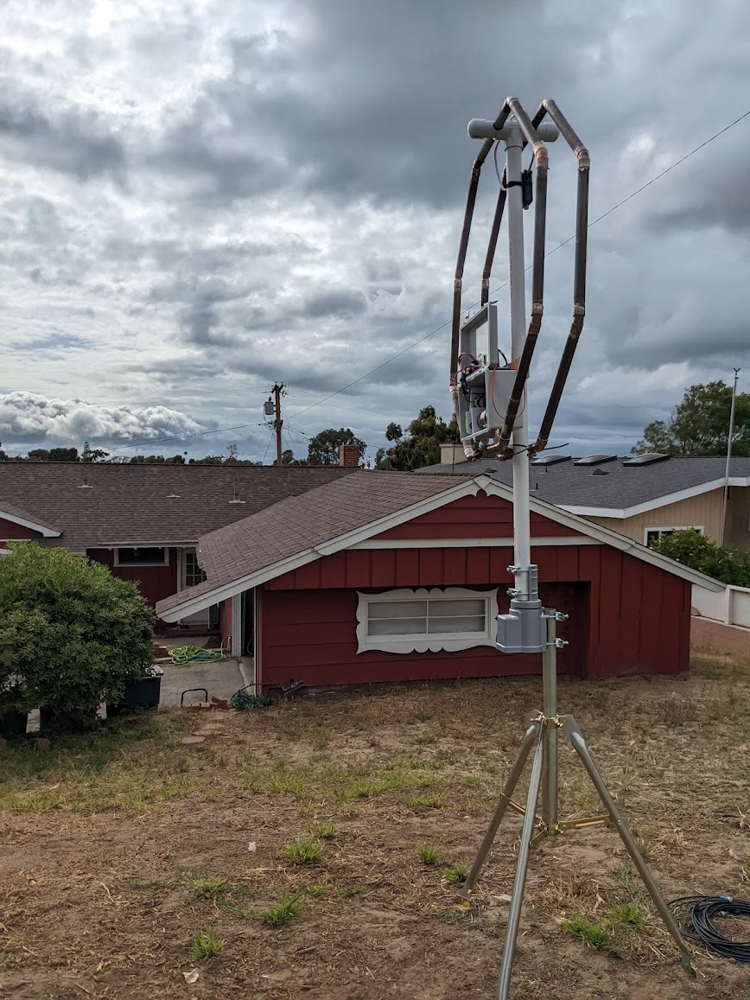

# Mag Loop Controller #

This is an ESP32-based controller remote for a magnetic loop antenna on HF frequencies.

There are two software parts to this project currently, each requiring their own ESP32 device to run.

This project uses PlatformIO to load the appropriate libraries. This project uses the
Arduino core libraries.

There is no automation for tuning in this project yet, but I may eventually get to it.

## Setup ##

The main pieces here are getting PlatformIO installed, and an IDE to manage it. 
Personally, I am using [PlatformIO Core](https://platformio.org/install/cli) with 
[CLion](https://www.jetbrains.com/clion/). However, a lot of people prefer
using [PlatformIO with VS Code](https://docs.platformio.org/en/latest//integration/ide/vscode.html).

## Mag Loop Controller HTTP ##

This project contains the code for an ESP32 hooked up to a an A4988 stepper motor driver.
The device will connect to wifi, and then register itself as an mDNS device, advertising itself
as `magloopcontroller.local`.

The main function resides in an asynchronous HTTP server. You can use your browser to make 
requests to the device and intiate stepper motor movements.

For example:
* `http://magloopcontroller.local:80/step?steps=20&dir=ccw` 
* `http://magloopcontroller.local:80/rotate?deg=-1080` 

There is currently no measuring of the antenna circuit, but that is something I may add later.
If you're interested in going that route, take a look at 
[this project](https://sites.google.com/site/lofturj/to-automatically-tune-a-magnetic-loop-antenna).

## Mag Loop Remote ##

This project is specifically made to run on an M5Stack device. It utilizes the screen and the 
three main buttons. 

This program will connect to wifi and then await the press of buttons. The middle button will 
change the step degrees. The left button will go counter clockwise at the currently selected
step degrees, and the right button will go clockwise.

When you press a button, the program will attempt to find the Mag Loop Controller via the mDNS
protocol that it should be registered within. It caches the IP address for a period of time if 
the controller is found. Then the program will make the appropriate HTTP request to the controller
device. 

## Background ##

Living in an urbran area, I am always experimenting with antennas. A magnetic loop antenna has
the highly desirable characteristics of being small and directional. However, it has the distinct 
disadvantage of being incredibly difficult to use. With a bandwidth of 5-10KHz, you can barely fit 
a few Single Sideband (SSB) signals in there. I managed to pick up two working high voltage variable
vacuum capacitors, built in the late 1940s but still functioning. 

Most commercial loops only cover either 20-10m or 80-30m. It turns out, this is a physical property
of the length of the loop. If you make a 1m loop, you get the former range, and if you double the 
loop around with twice the length but the same diameter, you get the latter range.

